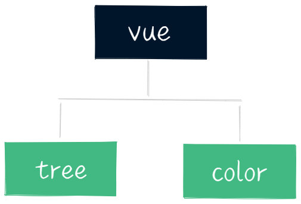

<p align="center">
    
    <h2 align="center"> vue-tree-color</h2>
    <p align="center"> v2.3.0 </p>
    <p align="center">  </p>
</p>

## Download dependency

``` shell
npm install
```

## Run the project

``` shell
npm run dev
```

## Packaged project

``` shell
npm run build
```

## Demo address
[Demo address](https://crazymryan.github.io/vue-tree-color)

[Code address](https://github.com/CrazyMrYan/vue-tree-color)

## How to contribute code
> If you also want to submit code for this repository, you can submit a pr or issue

e-mail : crazymryan@gmail.com